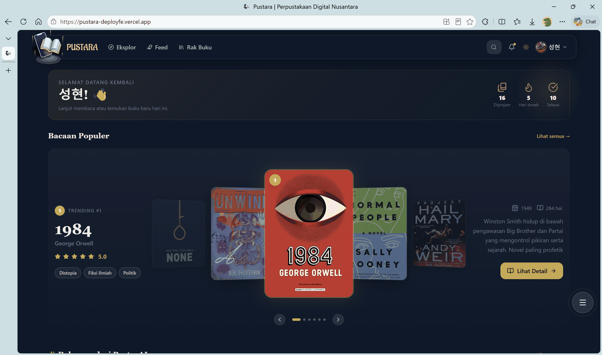
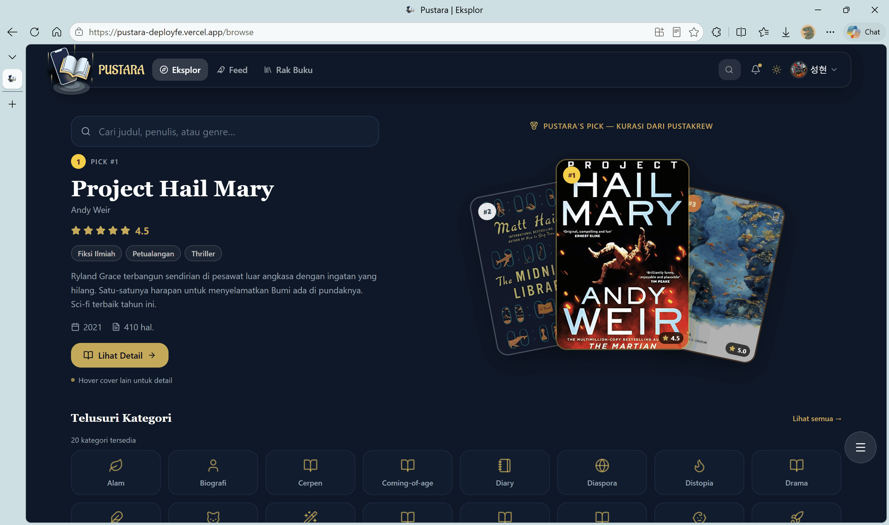
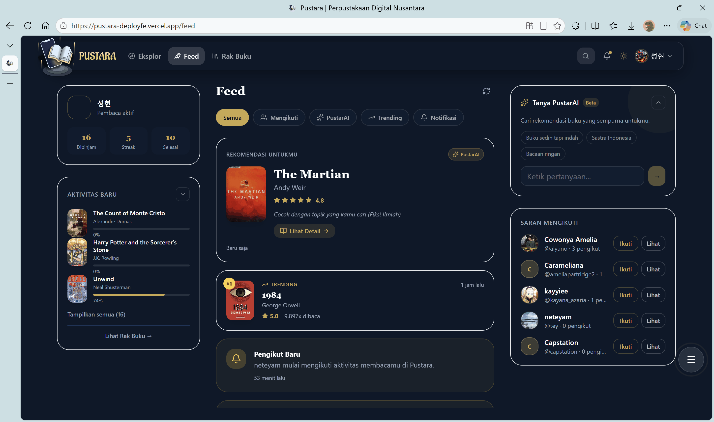
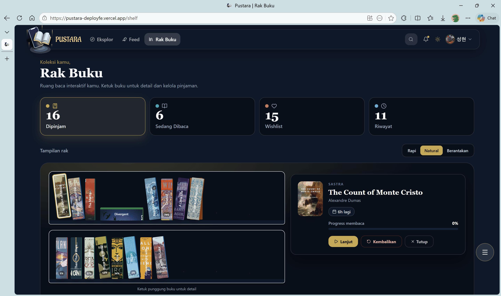
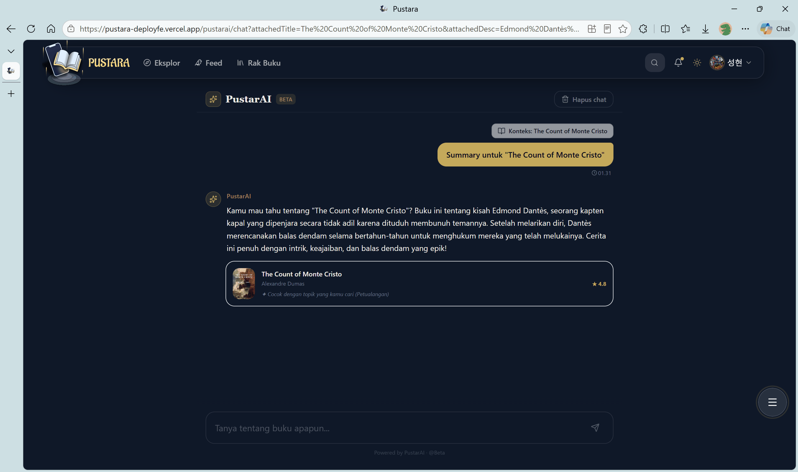
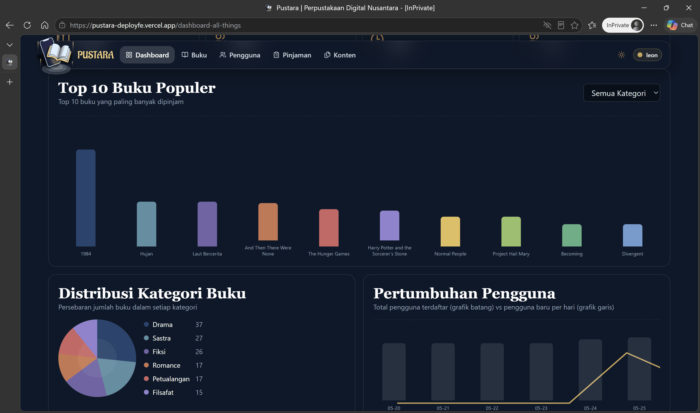
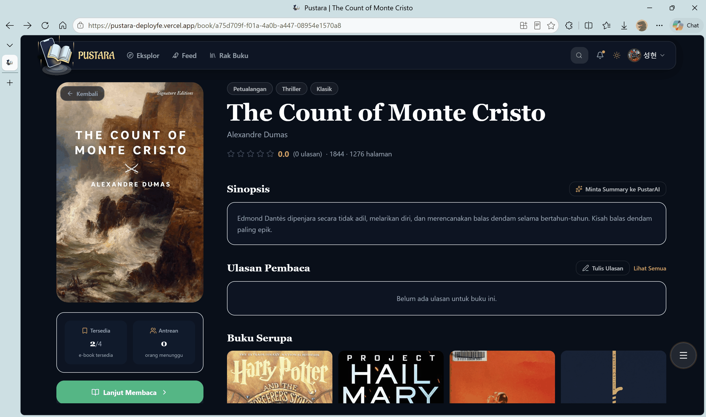

# Pustara Frontend

Frontend aplikasi Pustara untuk pembaca, komunitas, katalog, dan area admin.

<!-- Badges -->
[](https://nextjs.org) [](https://reactjs.org) [](https://tailwindcss.com) [](https://www.framer.com/motion/) [](#)

Pustara — read, discover, and share books with the community. ✨📚

Quick Start:

```bash
cd pustara-fe
cp .env.local.example .env.local
npm install
npm run dev
```

Open `http://localhost:3001` and explore the catalog, feed, shelf, and reader.

## Ringkasan

- **Framework**: Next.js App Router
- **Styling**: Tailwind CSS + CSS variables global
- **Auth**: Firebase Client SDK
- **State**: Zustand
- **Motion**: Framer Motion
- **Data**: REST backend + Supabase helpers
- **PDF**: `react-pdf` + `pdfjs-dist`
- **PWA**: `next-pwa`

## Fitur Utama

- Home personal dengan greeting, statistik, dan rekomendasi
- Catalog publik untuk user yang belum login
- Feed komunitas, notifikasi, dan saran mengikuti
- Browse, popular, shelf, profile, settings, dan reader
- Login, register, personalisasi, dan auth verification
- Admin panel untuk users, books, contents, dan loans management
- API routes internal untuk verifikasi token dan role

## Route Map

### Public / auth

- `/catalog`
- `/auth/login`
- `/auth/register`
- `/auth/personalization`

### User app

- `/`
- `/feed`
- `/browse`
- `/browse-genre`
- `/community`
- `/notifications`
- `/popular`
- `/profile`
- `/profile/[username]`
- `/shelf`
- `/settings`
- `/settings/privacy`
- `/book/[bookId]`
- `/book/[bookId]/reviews`
- `/read/[bookId]`
- `/pustarai/chat`

### Admin

- `/dashboard-all-things`
- `/books-management`
- `/users-management`
- `/contents-management`
- `/loans-management`

### API routes

- `/api/auth/verify-token`
- `/api/users`
- `/api/users/[uid]`
- `/api/admin/users/[uid]`
- `/api/verify-role`

## Setup

### 1. Install dependencies

```bash
cd pustara-fe
npm install
```

### 2. Copy env template

```bash
cp .env.local.example .env.local
```

### 3. Isi environment variables

Required/used keys dari kode:

- `NEXT_PUBLIC_FIREBASE_API_KEY`
- `NEXT_PUBLIC_FIREBASE_AUTH_DOMAIN`
- `NEXT_PUBLIC_FIREBASE_PROJECT_ID`
- `NEXT_PUBLIC_FIREBASE_STORAGE_BUCKET`
- `NEXT_PUBLIC_FIREBASE_MESSAGING_SENDER_ID`
- `NEXT_PUBLIC_FIREBASE_APP_ID`
- `NEXT_PUBLIC_API_URL`
- `NEXT_PUBLIC_GOOGLE_BOOKS_API_KEY`
- `NEXT_PUBLIC_TURNSTILE_SITE_KEY`

Opsional / server-side:

- `NEXT_PUBLIC_SUPABASE_URL`
- `NEXT_PUBLIC_SUPABASE_ANON_KEY`
- `NEXT_PUBLIC_EMAIL_ADMIN`
- `NEXT_PUBLIC_ADMIN_CONTACT_EMAIL`
- `DATABASE_URL`
- `TURNSTILE_SECRET_KEY`

### 4. Jalankan dev server

```bash
npm run dev
```

Lalu buka `http://localhost:3001`.

## Script

- `npm run dev` — jalankan development server
- `npm run build` — build production
- `npm run start` — jalankan hasil build
- `npm run lint` — linting Next.js
- `npm run postinstall` — copy `pdf.worker.min.mjs` ke `public/`

## Struktur Project

```
pustara-fe/
├── docs/
├── public/
├── src/
│   ├── app/
│   ├── components/
│   ├── hooks/
│   ├── lib/
│   ├── store/
│   └── types/
├── next.config.mjs
├── package.json
└── tailwind.config.js
```

## Arsitektur

- `src/app` berisi route pages, layout, metadata, dan API routes
- `src/components` berisi UI shared, home, admin, auth, theme, dan layout
- `src/lib` berisi client API, Firebase, Supabase, feed, shelf, users, reader, dan util lain
- `src/hooks` berisi logika reusable untuk auth, captcha, recommendations, covers, dan sebagainya
- `src/store` menyimpan state global seperti auth

## Komponen Inti

- `AuthProvider` menjaga status login user
- `ThemeProvider` mengatur dark/light mode
- `ToastProvider` menangani notifikasi UI
- `FABGuard` mengontrol tombol aksi mengambang
- `Navbar`, `HomePage`, `CatalogView`, `Shelf`, dan `Feed` jadi komponen utama user flow

## Auth Flow

```
User → Login/Register (Firebase Client SDK)
     → Firebase ID Token
     → Token dikirim ke backend via Authorization: Bearer <token>
     → Backend verifikasi pakai Firebase Admin SDK
     → Protected routes terbuka
```

Contoh request:

```typescript
import { apiGet, apiPost } from '@/lib/api';

const data = await apiGet('/api/protected');
const result = await apiPost('/api/books', { title: 'test' });
```

## Layout & UX

- Mobile: layout compact dan full-width friendly
- Desktop: panel dan sidebar lebih lebar
- Loading state banyak pakai `var(--bg)` supaya ikut tema
- Avatar, cover, dan feed banyak pakai fallback supaya aman saat data belum lengkap

## Catatan Kode

- Firebase hanya diinisialisasi di browser saat env lengkap tersedia
- `NEXT_PUBLIC_API_URL` dipakai sebagai base URL utama backend
- `TURNSTILE_SECRET_KEY` dipakai server-side, bukan di client
- `docs/` hanya folder statis tambahan, bukan inti aplikasi

## Screenshots

Live-styled docs are in the `docs/` folder. A few highlights:







Admin / tools:




Badge: [GitHub Pages](https://cheepi.github.io/pustara-fe/)